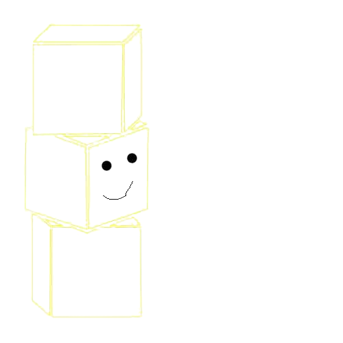

---
hide:
  - navigation
---

# ELIN

<div class="hero-section" markdown>

{ width="120" }

## The Bytecode Programming System

A little bytecode language made to run on [System Operating](https://schallten.github.io/system_operating/) and other tiny, low-power hardware. It's not a fully serious language, just a fun way to mess with stacks and bits.

<div class="cta-group" markdown>

[:material-book-open: Read the docs](docs/introduction.md){ .md-button .md-button--primary }
[:material-play: Play with the visualizer](visualizer.md){ .md-button }

</div>

</div>

---

## Features

<div class="grid cards" markdown>

- :material-memory: **Runs on almost nothing**

    ---

    It fits in about 32KB of RAM. Good for when you don't have much space to work with.

- :material-view-dashboard: **Just a Stack**

    ---

    Everything is a stack. No registers or fancy stuff, just pushing and popping values until it works.

- :material-cpu: **Built for System Operating**

    ---

    Mostly designed for [System Operating](https://schallten.github.io/system_operating/). If you're using that, this should work fine.

</div>

---

## What the code looks like

```elin
# Just a simple example
let int radius = 10;
let int pi = 3; 

func int area int r;
    let int res = r * r;
    return res * pi;
end;

print area radius; # Should output 300
```

---

<div class="not-a-big-deal" markdown>

## Not a big deal

This is just a hobby thing. There's no telemetry or weird stuff because there's no room for it anyway. 

[:material-cog: Check the setup guide](docs/setup.md)

</div>

---

ELIN_CORE // 2026 · STABLE v0.4.0
